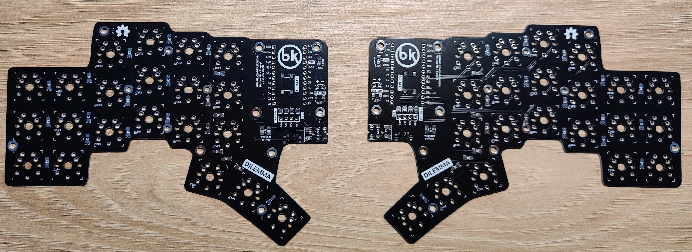
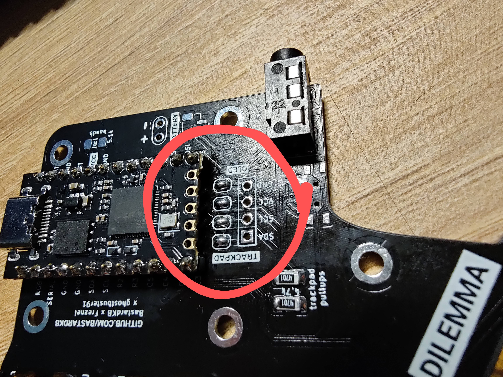
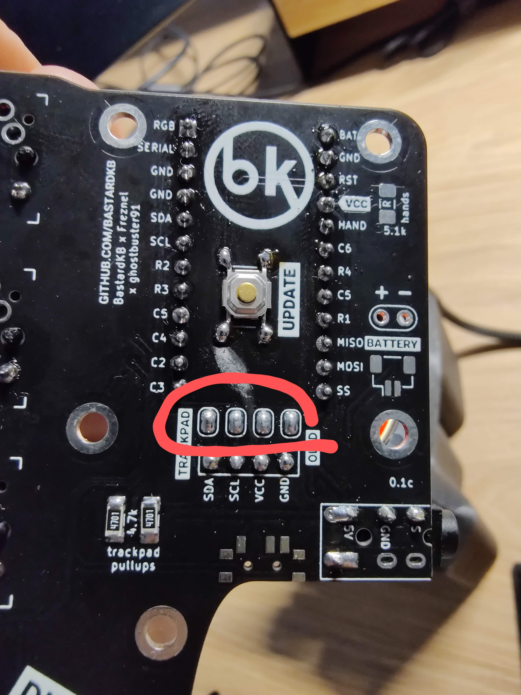
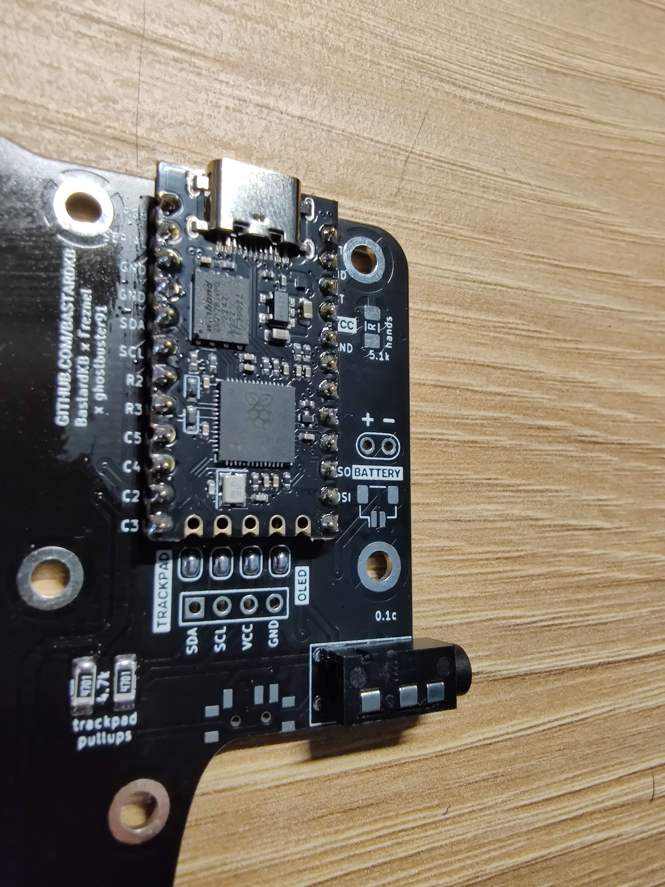
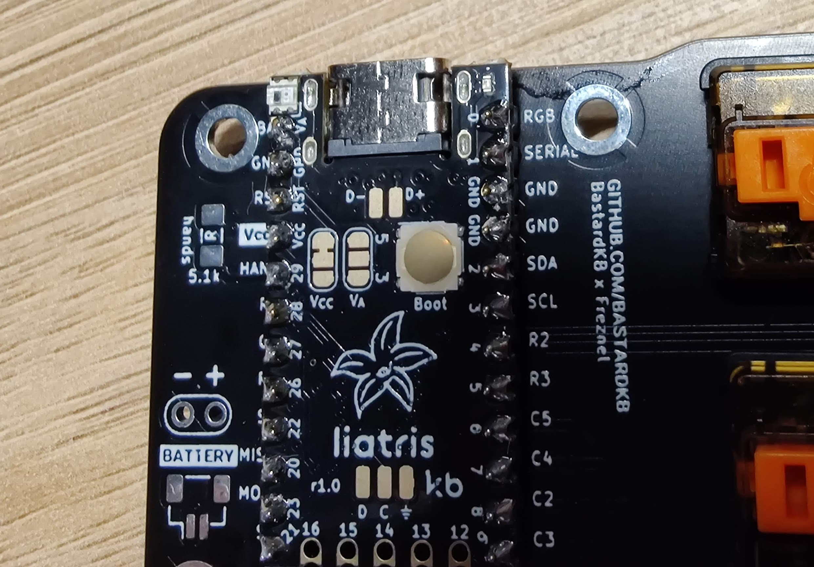
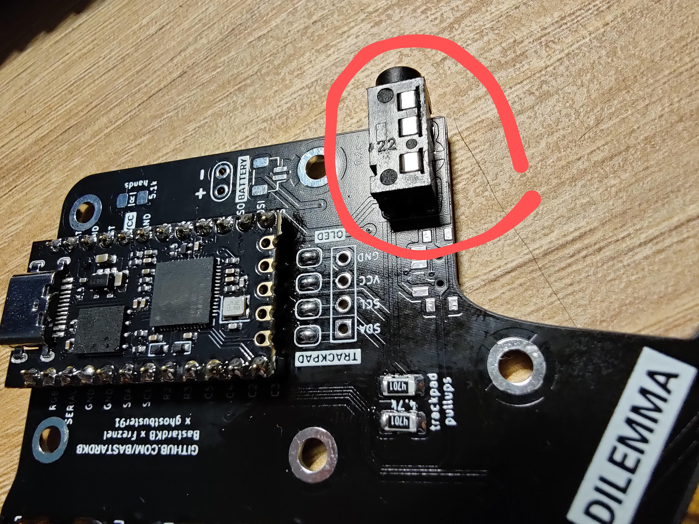
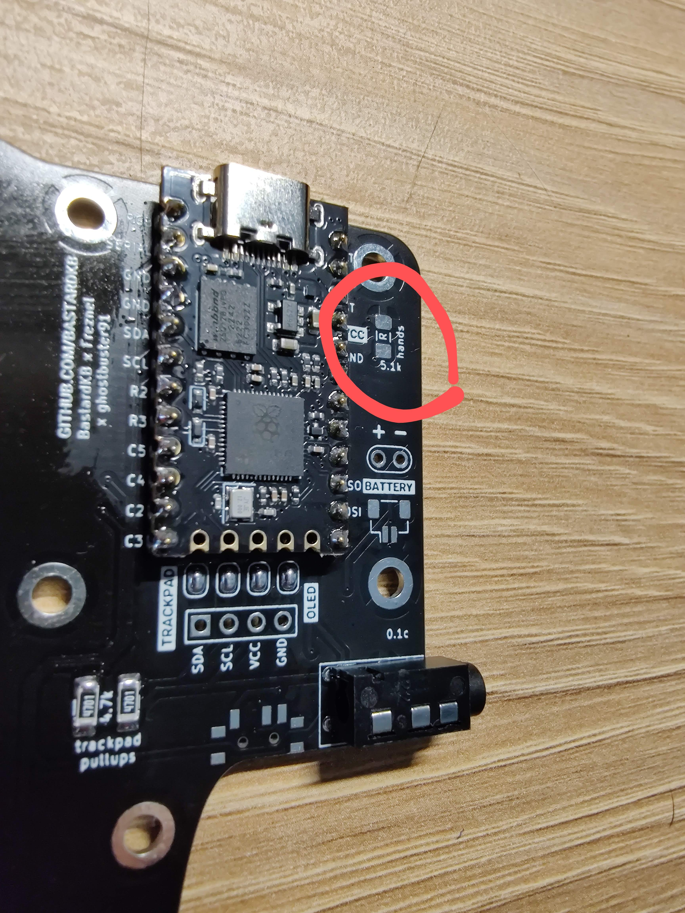
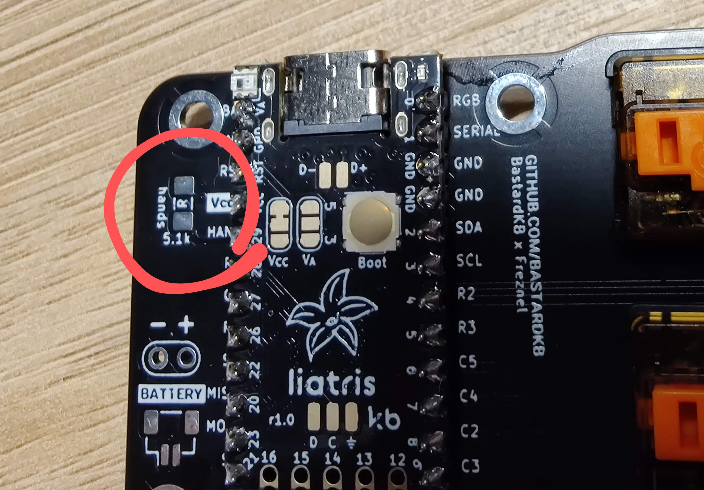
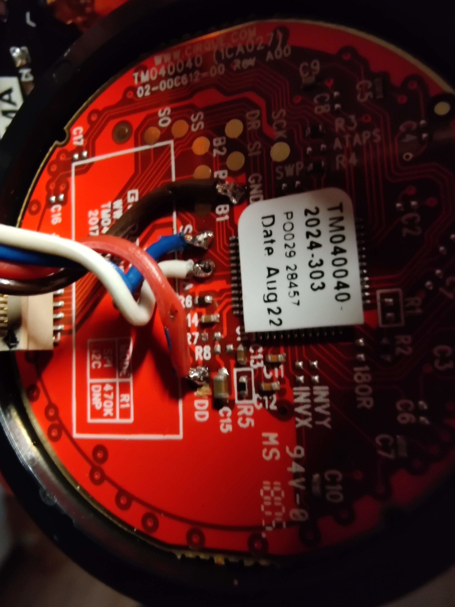
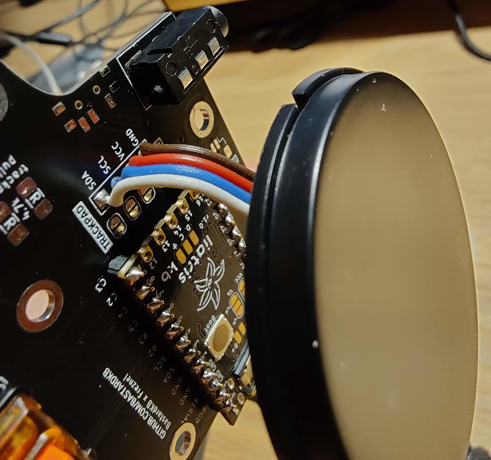

# Dilemma DIY build guide

This guide was done for a modified version of DIY Dilemma, however steps should be the same as the modification changes only the amount of switches.

The Dilemma PCB is a reversible PCB meaning that both halves are the same but because the bottom part is mirrored part of the top part it is possible to use it for the other side.

The current PCB project is done in a way that if you put two halves in front of you then the "front" ("red") layer is on the left side and the "bottom" ("blue") layer is on the right.



1. Soldering jumpers (optional)

This step is optional, do it only if you want to use OLED or I2C deviced on a particular side.

Jumpers have to be soldered on the "front" sides of both halves. That means that on the left side you will have to solder them on the top, and on the right side - on the bottom.




2. Install controller

_The Dilemma is only compatible with rp2040 boards._

To check if your controller is compatible refer to the following table: https://github.com/Bastardkb/technical-docs/wiki/RP2040-controllers

_Important_ Since one of the halves is flipped you will also have to flip one of yours controllers. Follow the legends both on the controller and the PCB to figuer out how to install it.
In my case the controller on the left had components facing up, and the one on the right side had components facing down.




3. Install the audio jack

Nothing special here. As an additional note it can be soldered on the top as well as on the bottom.



4. Install diodes

Again, nothing fancy. Can be soldered on either side. Pay attention to the orientation.

5. Install switches

Solder in your switches of preference.

6. Install reset button

Solder in reset buttons on the bottom of each half.

7. Enable handness (optional)

There is an optional feature called handness that allows keyboard to detect which side is master regardless of which one is connected to the PC.

https://github.com/Bastardkb/bastardkb-qmk/blob/dc3e11edcca343fe1a2ba550949bebeea407f8b9/keyboards/bastardkb/dilemma/3x5_2/splinky/config.h#L29

```c
// To use the handedness pin, resistors need to be installed on the PCB.
// If so, uncomment the following code, and undefine MASTER_RIGHT above.
//#define SPLIT_HAND_PIN GP29
// If you've soldered the handedness pull-up on the upper side instead of the
// left one, uncomment the following line.
//#define SPLIT_HAND_PIN_LOW_IS_LEFT // High -> right, Low -> left.
```

The idea is simple - one side pulls the pin high, and the other pulls the pin low.

For this to work "hand" resistors have to be installed on both sides on the same "side". Meaning that either both go on the top or one the bottom of the PCB.




8. Install cirque trackpad (optional)

The are three resistors that are important for us: R1, R7 and R8. R1 controls whether the device works in I2C or SPI mode. For the DIY Dilemma we need it to work in I2C mode which means that we need to desolder R1.
R7 and R8 need to be desoldered if you are going to supply the device with 5V. If you are going to power it with 3V then its fine and you don't have to touch them. For more info refer to https://github.com/Keycapsss/cirque-trackpad

Cirque trackpad is connected with the board using 4 pins: GND, VCC, SCL(clock) and SDA(data). That means to you need to figure out what kind of voltage you have on VCC.
You can check it in the specification of your controller, or you can measure it.

After that you need to connect pads from the PCB with corresponding pads on the Cirque trackpad.



