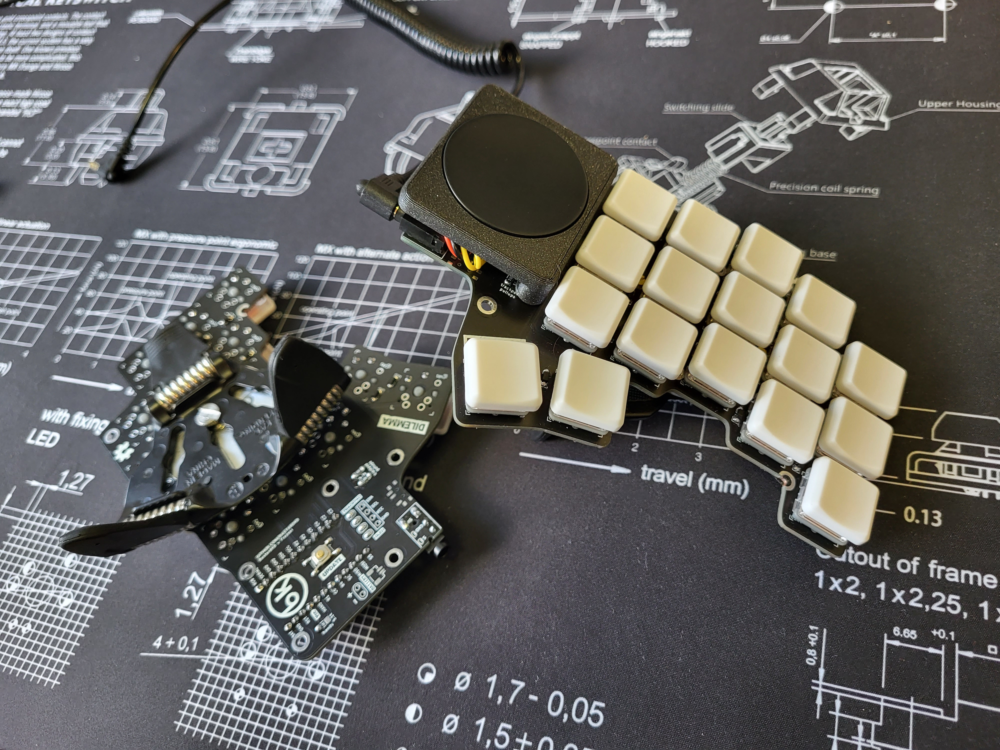

## Dilemma keyboard

A vertical stagger low-profile keyboard with mods.

### Features

- Heavy pinky stagger
- MX and choc compatible
- Reversible PCB
- Elite-C / Splinky / Nice!Nano compatible
- Tenting puck footprint

### Wireless abilities

ZMK does not support input devices at the moment, and QMK does not support BLE.

However, as this is meant to be a portable keyboard, some ground work has been laid:

- pinout compatible with nice!nano
- 2 battery connectors footprints: JST, and THT
- on / off button footprint

### BOM

// TODO

## Mods

### Cirque trackpad

This is the first mod made for the keyboard - so it can function as a standalone input device.

It requires an additional PCB, found here: https://github.com/Bastardkb/dilemma-cirque

// TODO instructions there on how to install it, with pullups

### Others / in progress

The PCB has available connectors for:

- oled 
- rotary encoder

