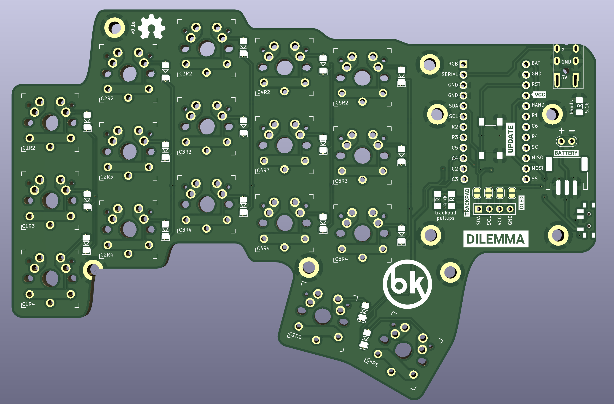

# Dilemma keyboard

A vertical stagger low-profile keyboard with mods.

## Features

- Heavy pinky stagger
- MX and choc compatible
- Reversible PCB
- Elite-pi / Splinky / Nice!Nano compatible
- Tenting puck footprint

## Versions

There are 2 versions of the dilemma, in 2 folders:

- `dilemma`, for DIY that requires an additional MCU (eg. kb2040)
- `dilemma_assembled`, for PCB assembly

The Dilemma is **made for rp2040**, so if you go with the DIY version you should source your MCU board accordingly.

## Wireless abilities

ZMK does not support input devices at the moment, and QMK does not support BLE.

However, as this is meant to be a portable keyboard, some ground work has been laid:

- pinout compatible with nice!nano
- 2 battery connectors footprints: JST, and THT
- on / off button footprint

## BOM

The PCB can work on standalone.

Depending on which version you go with, you will need to source different items.

On top of the basic build, you can add a range of options :

- 3d printed case
- mods (eg. trackpad)

Both versions require:

| Part name       | Amount | Link / source |
| --------------- | ------ | ------------- |
| Audio jack      | 2      |               |
| Button, 4x4x1.5 | 2      |               |

### DIY version

On top of the parts mentioned above, you will need:

| Part name        | Amount | Link / source               |
| ---------------- | ------ | --------------------------- |
| SOD123 Diodes    | 34     | Farnell, Mouser, Aliexpress |
| RP2040 MCU board | 2      | KB2040, elite-pi...         |
| Header pins      | 2*12   |                             |

### Assembled version

No further parts are necessary. If you install the trackpad mod, you will need some specific components, mentioned below.

### Trackpad mod

This is the first mod made for the keyboard - so it can function as a standalone input device.

It uses I2C on the DIY version, and SPI on the assembled version.

The DIY version requires removing 2 resistors from the trackpad (see build guide).

When installing the trackpad mod, you will need:

| Part name           | Amount | Link / source           |
| ------------------- | ------ | ----------------------- |
| M3 screw, torx, 6mm | 4      | Conrad                  |
| M3x5x5 screw insert | 4      | Aliexpress              |
| 3d printed parts    |        | See `mechanical` folder |

If building the PCBA version, you will also need:

| Part name                                                     | Amount | Link / source |
| ------------------------------------------------------------- | ------ | ------------- |
| 12-position FPC cable, 0.5mm pitch, same side contacts, 100mm | 1      | Farnell       |

If building the DIY version, you will also need:

| Part name               | Amount | Link / source |
| ----------------------- | ------ | ------------- |
| SOD123 Resistor, 5kOhms | 2      |               |
| Cables                  | 2      |               |

### 3d printed low profile case

// todo

### 3d printed high profile case with tenting pucks

// todo

## Others / in progress

The PCB has available connectors for:

- oled 

