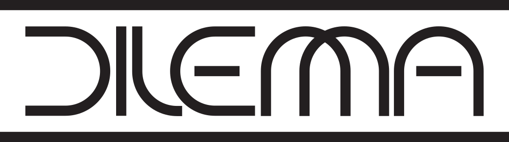
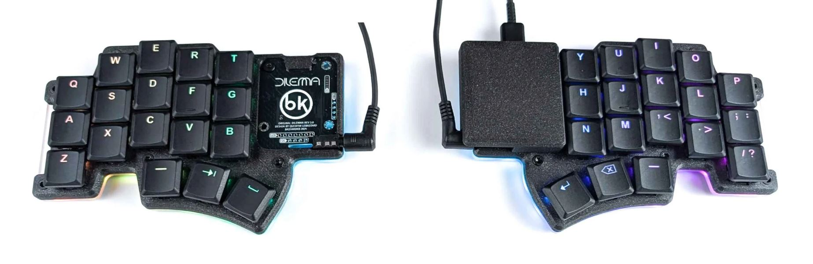

---

The Dilemma is a vertical stagger low-profile keyboard with mods.

## Table of contents

- [Features](#features)
- [Versions](#versions)
- [Required components](#required-components)
  - [3d prints - cases](#3d-prints---cases)
  - [Electronics](#electronics)
  - [Procyon mod](#procyon-mod)
  - [Trackpad mod](#trackpad-mod)
  - [Metal plates](#metal-plates)
  - [Community mods](#community-mods)
  - [Build guide](#build-guide)
  - [Forks](#forks)

---

# Features

- heavy pinky stagger
- MX and choc compatible
- version with hotswap
- underglow RGB, per-key RGB
- 2 Rotary encoders on thumb clusters
- connectors for OLED, LCD

# Versions

There are multiple versions of the dilemma:

| Folder          | Name               | Size  | PCBA | Trackpad | Switches         | Additional features                     |
| --------------- | ------------------ | ----- | ---- | -------- | ---------------- | --------------------------------------- |
| `3x5_2`         | Dilemma DIY V2     | 3x5+2 | no   | Cirque   | MX, Choc V1      |                                         |
| `3x5_3`         | Dilemma V3         | 3x5+3 | yes  | Cirque   | MX, Choc V1      | Underglow, per-key RGB, rotary encoders |
| `3x5_3_hotswap` | Dilemma V3 hotswap | 3x5+3 | yes  | Procyon  | Choc V1, hotswap | Underglow, per-key RGB, rotary encoders |
| `4x6_4`         | Dilemma MAX        | 4x6+4 | yes  | Cirque   | MX, Choc V1      | Underglow, per-key RGB, rotary encoders |

# Required components

## 3d prints - cases

You can find the required 3d prints in the `mechanical` folder.

Most cases require a transparent mid layer to look good. You can either print it, or order it cut in acrylic.

## Electronics

The new revisions are made to be PCBA'd, you can find the gerber, BOM and POS files in the [Releases](https://github.com/bastardkb/dilemma/releases) section.

## Procyon mod

The `dilemma v3 hotswap` is made to work with a [Procyon PCB](https://github.com/bstiq/procyon).

## Trackpad mod

This is the first mod made for the keyboard - so it can function as a standalone input device.

## Metal plates

Optional metal plates enables the use of tripods through magsafe magnets.

Order the [metal plates](mechanical/plates/v2/bottom_metal.dxf) in 3mm thickness. The metal needs to be *magnetized* !
Grab the appropriate DXF from the matched folder.

You will need:

| Part name              | Amount | Details           |
| ---------------------- | ------ | ----------------- |
| Metal plates           | 2      | 3mm               |
| Tripods                | 2      | Neewer Z flex     |
| Magsafe tripod adapter | 2      | Amazon/Aliexpress |

## Community mods

There are a range of community mods available (hex plates, covers...).

You can find more information in the readme in the `mechanical/community mods` folder.

## Build guide

https://docs.bastardkb.com/bg_dilemma/

## Forks

- [3x6 version](https://github.com/bstiq/Dilemma_3x6/)
- [3x5 + 3 version](https://github.com/dixls/Dilemma-3mod)
