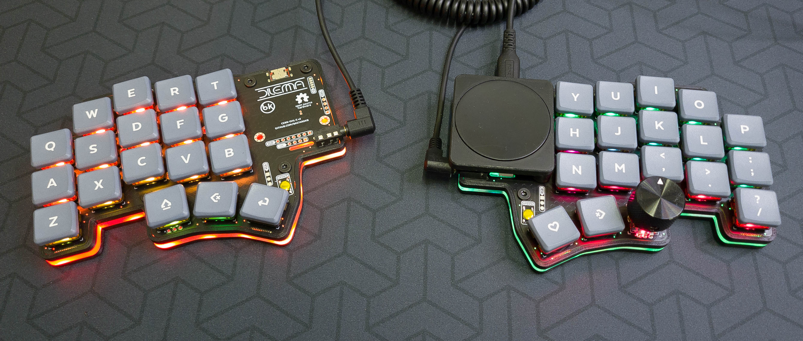
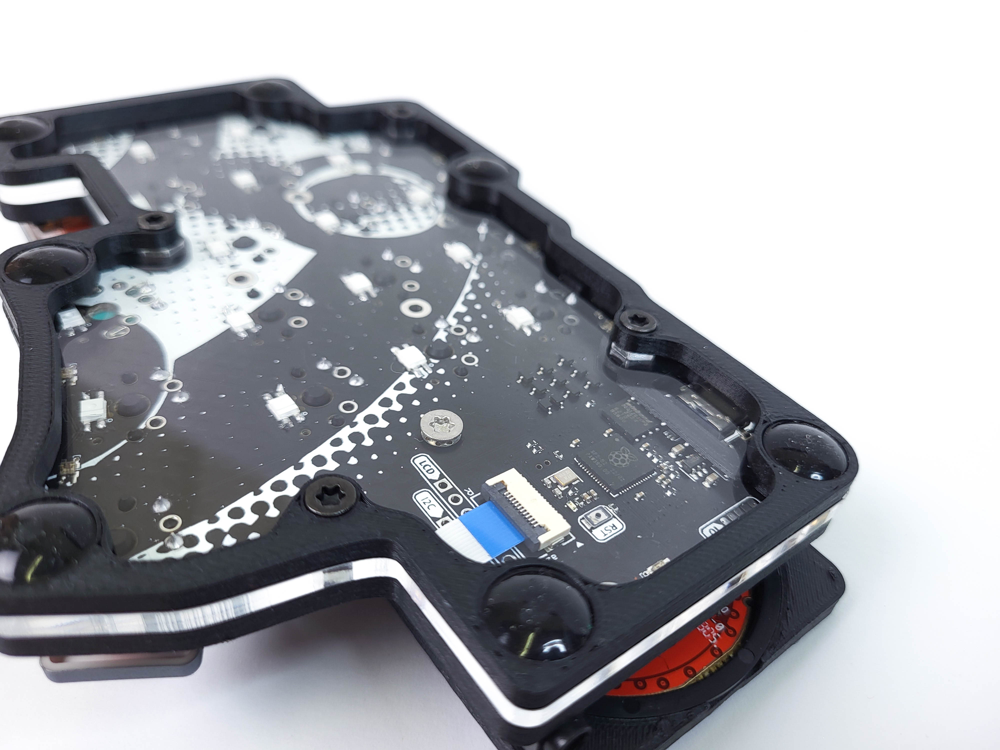
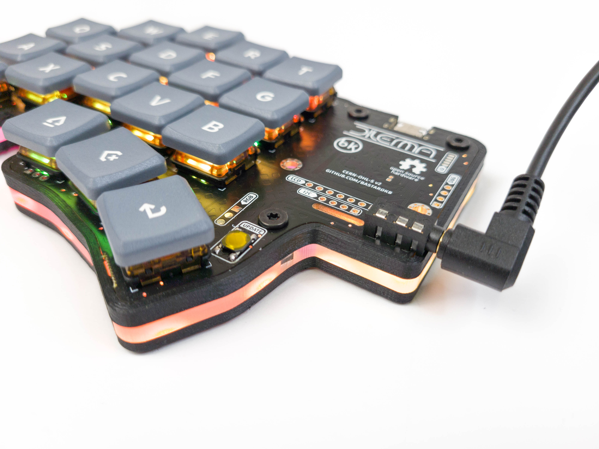
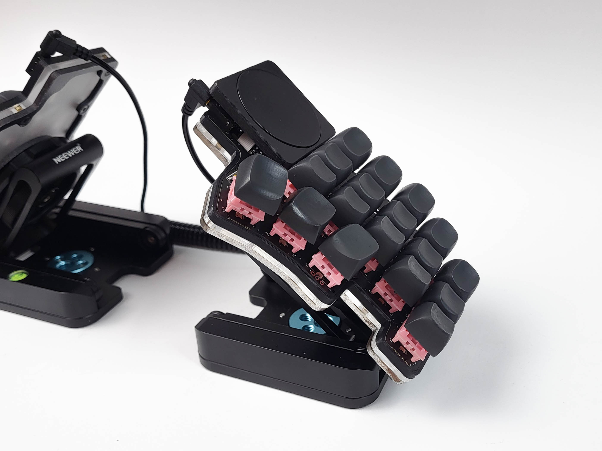
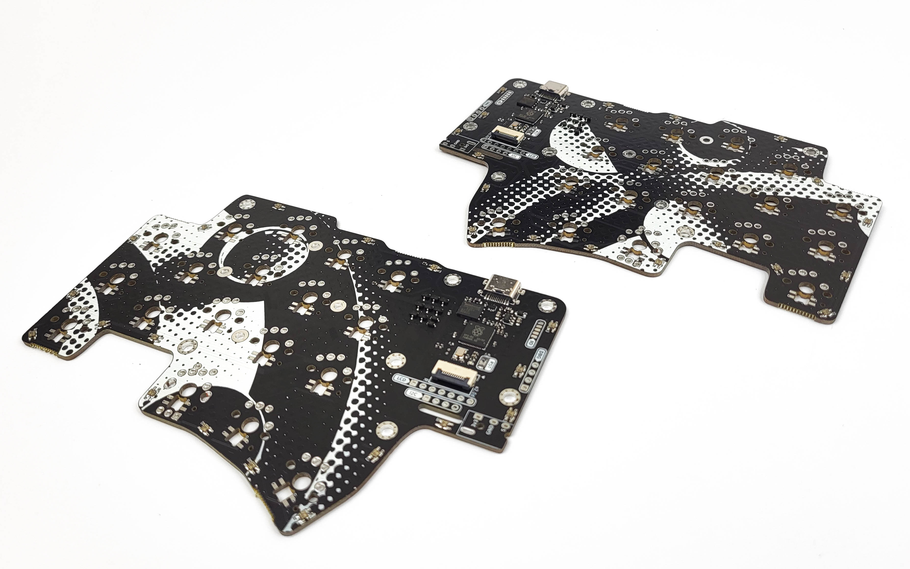

---

The Dilemma is a vertical stagger low-profile keyboard with mods.

## Table of contents

- [Print the appropriate parts from the `mechanical` folder.](#print-the-appropriate-parts-from-the-mechanical-folder)
  - [Cases](#cases)
    - [Cases](#cases-1)
    - [Acrylic midplate (v2 only)](#acrylic-midplate-v2-only)
    - [Acrylic bottom plate](#acrylic-bottom-plate)
    - [Tents - metal bottom plate](#tents---metal-bottom-plate)
    - [3d printed thin case (v1 only)](#3d-printed-thin-case-v1-only)
    - [3d printed less-thin case with tenting pucks (v1 only)](#3d-printed-less-thin-case-with-tenting-pucks-v1-only)
  - [Community mods](#community-mods)
  - [Build guide](#build-guide)
  - [Forks](#forks)
  - [Support me on Patreon](#support-me-on-patreon)
  - [Others / in progress](#others--in-progress)

---

## Features

- Heavy pinky stagger
- MX and choc compatible
- Underglow RGB, Per-key RGB
- 2 Rotary encoders on thumb clusters

## Versions

There are 2 versions of the dilemma, in 2 folders:

- `dilemma`, for DIY that requires an additional MCU (eg. kb2040)
- `dilemma_assembled`, for PCB assembly

The Dilemma is **made for rp2040**, so if you go with the DIY version you should source your MCU board accordingly.

## Wireless abilities

ZMK does not support input devices at the moment, and QMK does not support BLE.

However, as this is meant to be a portable keyboard, some ground work has been laid with the DIY version:

- pinout compatible with nice!nano
- 2 battery connectors footprints: JST, and THT
- on / off button footprint

At this time, the assembled version does not support wireless.

## BOM

The PCB can work on standalone.

Depending on which version you go with, you will need to source different items.

On top of the basic build, you can add a range of options, which require additional components:

- 3d printed case
- mods (eg. trackpad)

Both versions of the Dilemma require:

| Part name       | Amount | Link / source |
| --------------- | ------ | ------------- |
| Audio jack      | 2      |               |
| Button, 4x4x1.5 | 2      |               |

### DIY version

 
On top of the parts mentioned above, you will need:

| Part name               | Amount | Link / source               |
| ----------------------- | ------ | --------------------------- |
| SOD123 Diodes           | 34     | Farnell, Mouser, Aliexpress |
| Dilemma PCB, DIY, 1.2mm | 2      | See Release section         |
| RP2040 MCU board        | 2      | KB2040, elite-pi...         |
| Header pins             | 2*12   |                             |

Please note, **the Dilemma is compatible only with rp2040 boards !**

The release section contains the latest gerbers.

Order in 1.2mm thickness.

### Assembled version

On top of the parts mentioned above, you will need:

| Part name                     | Amount | Link / source       |
| ----------------------------- | ------ | ------------------- |
| Dilemma PCB, assembled | 2      | See Release section |

The release section contains the latest gerbers with BOM and POS files.

Order in 1.6mm thickness.

### Trackpad mod

This is the first mod made for the keyboard - so it can function as a standalone input device.

It uses I2C on the DIY version, and SPI on the assembled version.

The DIY version requires removing 2 resistors from the trackpad (see build guide).

When installing the trackpad mod, you will need:

| Part name           | Amount | Link / source           |
| ------------------- | ------ | ----------------------- |
| M3 screw, torx, 6mm | 4      | Conrad                  |
| M3x5x5 screw insert | 4      | Aliexpress              |
| 3d printed parts    |        | See `mechanical` folder |
| 40mm cirque trackpad, curved    |        | |

If building the PCBA version, you will also need:

| Part name                                                     | Amount | Link / source |
| ------------------------------------------------------------- | ------ | ------------- |
| 12-position FPC cable, 0.5mm pitch, same side contacts, 100mm | 1      | Farnell       |

If building the DIY version, you will also need:

| Part name               | Amount | Link / source |
| ----------------------- | ------ | ------------- |
| SOD123 Resistor, 5kOhms | 2      |               |
| Cables                  |        |               |

## Cases

### Acrylic midplate (v2 only)

This case is only compatible with the assembled_v2 version !

Add an underglow effect and a beautiful view into the PCB with those acrylic midplates.

You will need

| Part name           | Amount | Details      |
| ------------------- | ------ | ----------------------- |
| [3d printed top plate](mechanical/plates/v2/top.stl) | 2      | 1 left, 1 right                  |
|[acrylic mid plate](mechanical/plates/v2/mid_acry_full.dxf) | 2      | Order transparent or frost, 3mm         |
|  [3d printed bottom plate](mechanical/plates/v2/bottom.stl)*   |  2      | 1 left, 1 right  |
|  M3x4 flat head screw   |  8      |  |
|  M3x4 chamfered head screw   |  10      |  |
|  M3x5 female/female spacer   |  8      |  |
|  M3x5 male/female spacer    |  2      |  |

*the 3d printed bottom plate can be swapped out for a full acrylic bottom plate, or a metal plate for the magnet mod (see following sections).

### Acrylic bottom plate

If you are using the acrylic midplate, you can install a full bottom plate. Order the [bottom acrylic plates](mechanical/plates/v2/bottom_acry_full.dxf) in 3mm thickness.

You will also need to chamfer the M3 holes for the screws to be flush.

### Tents - metal bottom plate

This plate enables the use of tripods through magsafe magnets.

Order the [metal plates](mechanical/plates/v2/bottom_metal.dxf) in 3mm thickness. The metal needs to be *magnetized* !

You will also need to chamfer the M3 holes for the screws to be flush.

You will need:

| Part name               | Amount | Details |
| ----------------------- | ------ | ------------- |
| Metal plates | 2      |         3mm|
| Tripods                  |   2     |    Neewer Z flex           |
| Magsafe tripod adapter                  |   2     |  Amazon/Aliexpress             |

### 3d printed thin case (v1 only)

This case is only compatible with the DIY and assembled_v1 versions !

Designed for the minimum footprint possible, while still protecting the PCB.

| Part name              | Amount          | Link / source           |
| ---------------------- | --------------- | ----------------------- |
| M3 screw, torx, 6mm    | 6               | Conrad                  |
| M3 nut                 | 3               | Conrad                  |
| Anti slip pads, 10x2mm | 12              | Aliexpress              |
| 3d case                | 1 right, 1 left | See `mechanical` folder |

The case is reversible.

It needs to be printed at 0.2mm layer height supportless specifically for the nut inserts suport-less interfaces. If you are doing a different layer height, use supports. 

### 3d printed less-thin case with tenting pucks (v1 only)

This case is only compatible with the DIY and assembled_v1 versions !

Accomodates the Splitkb tenting puck, to be used with a Manfrotto tripod.

There are a range of cases available. See details in the `mechanical/cases` folder.

## Community mods

There are a range of community mods available (hex plates, covers...).

You can find more information in the readme in the `mechanical/community mods` folder.

## Build guide

https://docs.bastardkb.com/hc/en-us/sections/6848232395410-Dilemma

## Forks

- [3x6 version](https://github.com/bstiq/Dilemma_3x6/)
- [3x5 + 3 version](https://github.com/dixls/Dilemma-3mod)

## Support me on Patreon

If you like the keyboard, please consider helping me with Patreon: https://www.patreon.com/bastardkb

I post regular updates and hindsight on my work. I work full time on keyboard innovation, and this helps a lot !

## Others / in progress

The PCB has available connectors for:

- oled 

