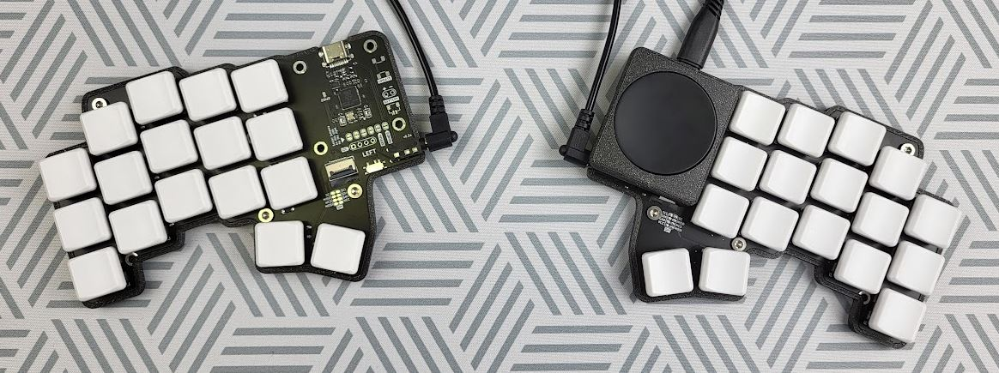
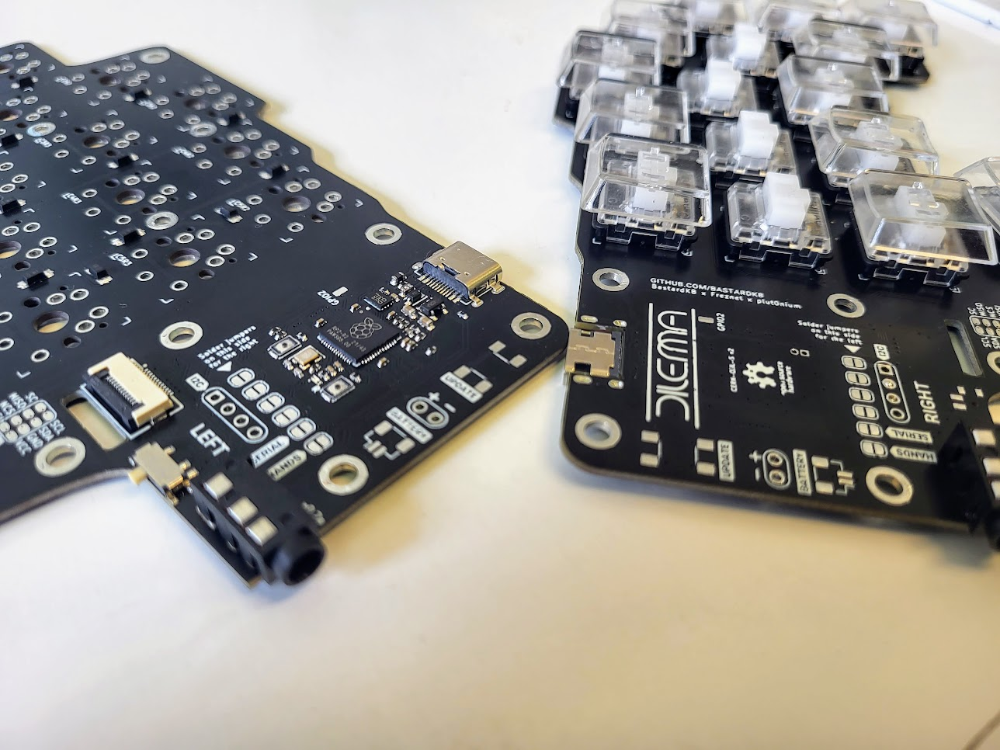
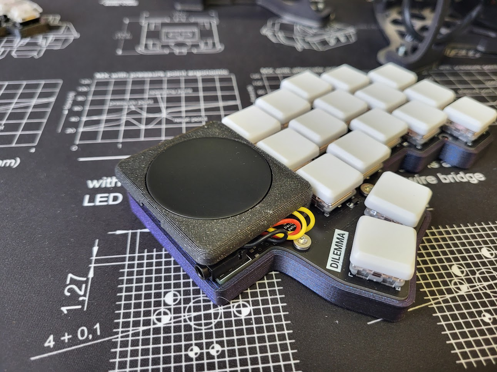
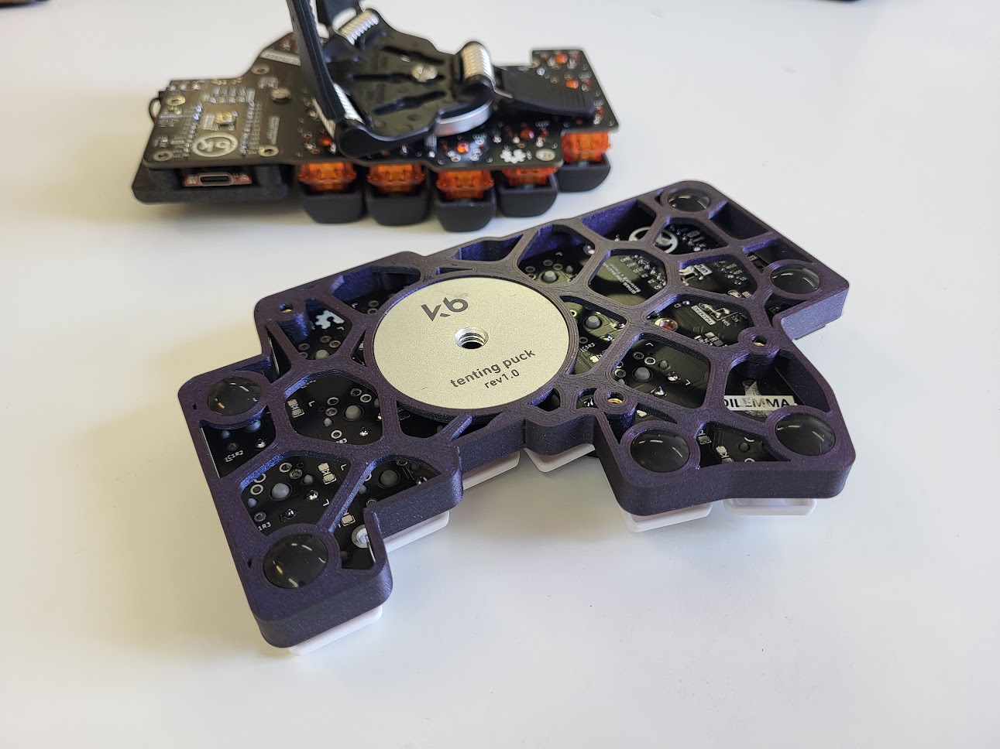

# Dilemma keyboard

A vertical stagger low-profile keyboard with mods.

- [Dilemma keyboard](#dilemma-keyboard)
  - [Features](#features)
  - [Versions](#versions)
  - [Wireless abilities](#wireless-abilities)
  - [BOM](#bom)
    - [DIY version](#diy-version)
    - [Assembled version](#assembled-version)
    - [Trackpad mod](#trackpad-mod)
    - [3d printed thin case](#3d-printed-thin-case)
    - [3d printed less-thin case with tenting pucks](#3d-printed-less-thin-case-with-tenting-pucks)
  - [Build guide](#build-guide)
  - [Support me on patreon](#support-me-on-patreon) 
  - [Others / in progress](#others--in-progress)

## Features

- Heavy pinky stagger
- MX and choc compatible
- Reversible PCB
- Elite-pi / Splinky / Nice!Nano compatible
- Tenting puck footprint

## Versions

There are 2 versions of the dilemma, in 2 folders:

- `dilemma`, for DIY that requires an additional MCU (eg. kb2040)
- `dilemma_assembled`, for PCB assembly

The Dilemma is **made for rp2040**, so if you go with the DIY version you should source your MCU board accordingly.

## Wireless abilities

ZMK does not support input devices at the moment, and QMK does not support BLE.

However, as this is meant to be a portable keyboard, some ground work has been laid with the DIY version:

- pinout compatible with nice!nano
- 2 battery connectors footprints: JST, and THT
- on / off button footprint

At this time, the assembled version does not support wireless.

## BOM

The PCB can work on standalone.

Depending on which version you go with, you will need to source different items.

On top of the basic build, you can add a range of options, which require additional components:

- 3d printed case
- mods (eg. trackpad)

Both versions of the Dilemma require:

| Part name       | Amount | Link / source |
| --------------- | ------ | ------------- |
| Audio jack      | 2      |               |
| Button, 4x4x1.5 | 2      |               |

### DIY version

 
On top of the parts mentioned above, you will need:

| Part name               | Amount | Link / source               |
| ----------------------- | ------ | --------------------------- |
| SOD123 Diodes           | 34     | Farnell, Mouser, Aliexpress |
| Dilemma PCB, DIY, 1.2mm | 2      | See Release section         |
| RP2040 MCU board        | 2      | KB2040, elite-pi...         |
| Header pins             | 2*12   |                             |

Please note, **the Dilemma is compatible only with rp2040 boards !**

The release section contains the latest gerbers.

Order in 1.2mm thickness.

### Assembled version

On top of the parts mentioned above, you will need:

| Part name                     | Amount | Link / source       |
| ----------------------------- | ------ | ------------------- |
| Dilemma PCB, assembled, 1.2mm | 2      | See Release section |

The release section contains the latest gerbers with BOM and POS files.

Order in 1.2mm thickness.

### Trackpad mod

This is the first mod made for the keyboard - so it can function as a standalone input device.

It uses I2C on the DIY version, and SPI on the assembled version.

The DIY version requires removing 2 resistors from the trackpad (see build guide).

When installing the trackpad mod, you will need:

| Part name           | Amount | Link / source           |
| ------------------- | ------ | ----------------------- |
| M3 screw, torx, 6mm | 4      | Conrad                  |
| M3x5x5 screw insert | 4      | Aliexpress              |
| 3d printed parts    |        | See `mechanical` folder |

If building the PCBA version, you will also need:

| Part name                                                     | Amount | Link / source |
| ------------------------------------------------------------- | ------ | ------------- |
| 12-position FPC cable, 0.5mm pitch, same side contacts, 100mm | 1      | Farnell       |

If building the DIY version, you will also need:

| Part name               | Amount | Link / source |
| ----------------------- | ------ | ------------- |
| SOD123 Resistor, 5kOhms | 2      |               |
| Cables                  |        |               |

### 3d printed thin case

Designed for the minimum footprint possible, while still protecting the PCB.

| Part name              | Amount          | Link / source           |
| ---------------------- | --------------- | ----------------------- |
| M3 screw, torx, 6mm    | 6               | Conrad                  |
| M3 nut                 | 3               | Conrad                  |
| Anti slip pads, 10x2mm | 12              | Aliexpress              |
| 3d case                | 1 right, 1 left | See `mechanical` folder |

The case is reversible.

It needs to be printed at 0.2mm layer height supportless specifically for the nut inserts suport-less interfaces. If you are doing a different layer height, use supports. 

### 3d printed less-thin case with tenting pucks

Accomodates the Splitkb tenting puck, to be used with a Manfrotto tripod.

BOM:

| Part name              | Amount          | Link / source           |
| ---------------------- | --------------- | ----------------------- |
| M3 screw, torx, 6mm    | 6               | Conrad                  |
| M3 nut                 | 3               | Conrad                  |
| Anti slip pads, 10x2mm | 12              | Aliexpress              |
| Tenting puck assembly  | 1               | Splitkb                 |
| Manfrotto tripod       | 2               | Manfrotto               |
| 3d case                | 1 right, 1 left | See `mechanical` folder |

The case is reversible.

It needs to be printed at 0.2mm layer height supportless specifically for the nut inserts suport-less interfaces. If you are doing a different layer height, use supports.

## Build guide

https://docs.bastardkb.com/hc/en-us/sections/6848232395410-Dilemma

## Support me on Patreon

If you like the keyboard, please consider helping me with Patreon: https://www.patreon.com/bastardkb

I post regular updates and hindsight on my work. I work full time on keyboard innovation, and this helps a lot !

## Others / in progress

The PCB has available connectors for:

- oled 

