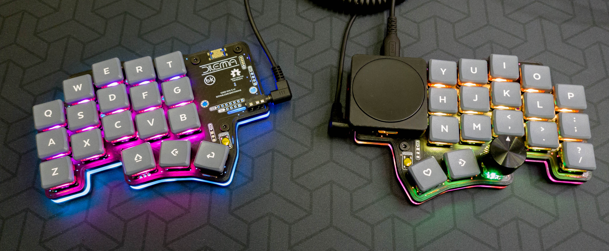

# 3d printed cases

## Table of contents

- [3d printed thin case](#3d-printed-thin-case)
- [3d printed case with tenting pucks](#3d-printed-case-with-tenting-pucks)
- [3d printed Tenting puck Hex case](#3d-printed-tenting-puck-hex-case)

## 3d printed thin case

Designed for the minimum footprint possible, while still protecting the PCB.

### BOM

| Part name              | Amount          | Link / source           |
| ---------------------- | --------------- | ----------------------- |
| M3 screw, torx, 6mm    | 6               | Conrad                  |
| M3 nut                 | 3               | Conrad                  |
| Anti slip pads, 10x2mm | 12              | Aliexpress              |
| 3d case                | 1 right, 1 left | See `mechanical` folder |

### Notes

The case is reversible.

It needs to be printed at 0.2mm layer height supportless specifically for the nut inserts suport-less interfaces. If you are doing a different layer height, use supports. 

## 3d printed case with tenting pucks

Accomodates the Splitkb tenting puck, to be used with a Manfrotto tripod.

### BOM

| Part name              | Amount          | Link / source           |
| ---------------------- | --------------- | ----------------------- |
| M3 screw, torx, 6mm    | 6               | Conrad                  |
| M3 nut                 | 3               | Conrad                  |
| Anti slip pads, 10x2mm | 12              | Aliexpress              |
| Tenting puck assembly  | 1               | Splitkb                 |
| Manfrotto tripod       | 2               | Manfrotto               |
| 3d case                | 1 right, 1 left | See `mechanical` folder |

### Notes

The case is reversible.

It needs to be printed at 0.2mm layer height supportless specifically for the nut inserts suport-less interfaces. If you are doing a different layer height, use supports.

## 3d printed Tenting puck Hex case

Credit: Frapiscide.

Old-school hex-style cases for the Manfrotto tripod.

There are 2 versions available:

- with a hole for the SplitKB tenting puck
- with an integrated 3d printed puck assembly, to screw the tripod in directly. 

### BOM

| Part name               | Amount | Notes               |
| ----------------------- | ------ | --------------------------- |
| M3x6 BHCS           | 3     | M3x8 BHCS work too |
| M3 Hex Nut | 3      |          |
| 3d printed case | 2      | Right / Left*        |

* You will need to print 2 cases - you can reverse it in your slicing software.

There are 2 versions:
- integrated holes to screw the manfrotto tripod directly
- hole for the splitkb tenting puck 

### Notes

- The case was designed around the DIY v0.1c PCB. Other versions may work but have not been verified
- The STL's are pre-oriented for their preferred printing position for FDM
- None of the parts need supports
- The case has .25mm of clearance all around the perimeter of the PCB
- The parts can be mirrored for whichever side you want the part for. The case and blank cover are originally modelled for the left side and the cirque holder for the right side. (Rev 1)
