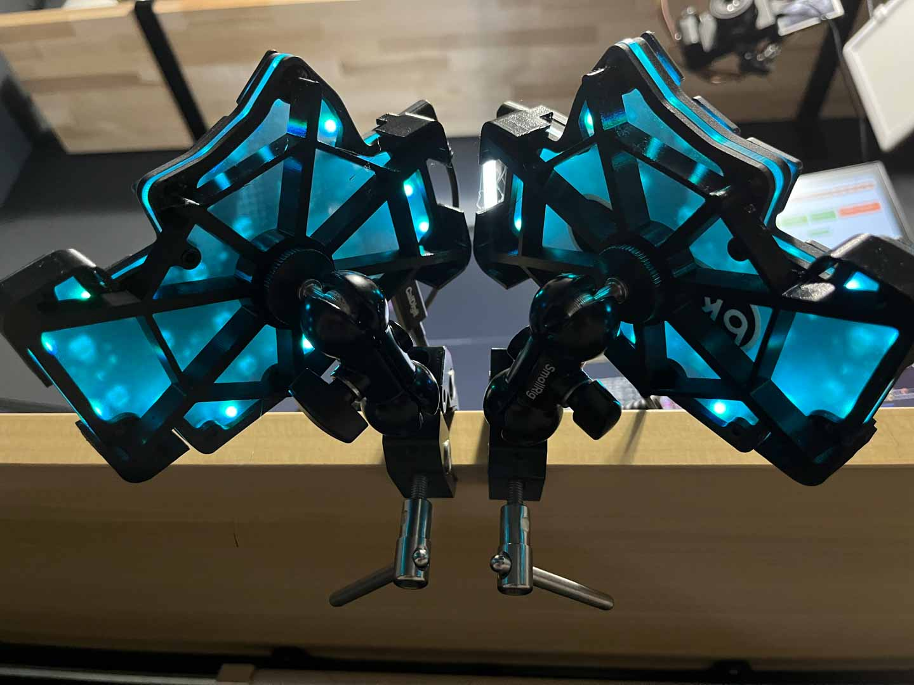

# Community Mods

## Cirque holder for flat overlay

Credit: Frapiscide.

A simple holder for the flat overlay cirque trackpad.

Files are in the `40mm_flat_overlay` folder.

### BOM

| Part name               | Amount | Notes               |
| ----------------------- | ------ | --------------------------- |
| M3x4 Heat-set inserts           | 4     |  |
| M3x6 BHCS / SHCS | 4      |          |
| 40mm cirque trackpad, flat overlay | 1      | TM040040-2024-302         |
| Pieces of 1.75mm Filament | 3      | 50-75mm is more than enough*        |

* If you do not have filament available, alignment key STL's are included

### Notes

- The STL's are pre-oriented for their preferred printing position for FDM
- None of the parts need supports
- The Cirque trackpad holder should work with MX keycaps (18mm x 18mm) but has not been verified. (Rev 1)
- The cirque holder was tested with Cirque Part Number TM040040-2024-302. Others may fit but have not been verified.
- The upper and lower cirque holders require bits of filament and adhesive to hold the two parts together. It was designed this way to prevent the use of supports and maintain dimensional accuracy
- The filament / alignment keys are intentionally a tight fit to maintain alignment.

## Blank cover

Credit: Frapiscide.

### BOM

| Part name               | Amount | Notes               |
| ----------------------- | ------ | --------------------------- |
| M3x4 Heat-set inserts           | 4     |  |
| M3x6 BHCS / SHCS | 4      |          |
| 40mm cirque trackpad, flat overlay | 1      | TM040040-2024-302         |
| Pieces of 1.75mm Filament | 3      | 50-75mm is more than enough*        |

### Notes
- The STL's are pre-oriented for their preferred printing position for FDM.
- None of the parts need supports.

## Dilemma Max Tents
No extras required - same screws and silicon bumpers can be reused.

5,7 and 15 degrees tents are available. Print on flat side. Tolerances might be quite tight, for ABS adjust for shrinkage.

## Dilemma V2  Mounts
Credit: [@brennanxyz](https://github.com/brennanxyz)

Files are in the `3x5_3_mounts` folder.

There are two pairs of files for two different tenting solutions,
derived from the same base design. One is a table-top set of tent frames,
the other is a board bracket meant to be paired with magic arm + clamp
tool.

### Table-top tent
These are free-standing, 30° tilting tents that lie on any flat surface. It
is designed around the fully-assembled Dilemma V2 stock assembly. 

#### Required materials:
- 89517.412 mm³ of plastic per half
- (Optional, highly recommended) 8 stick-on rubber feet per half - 7 placed
at the tip of each "arm" and once placed at the central nexus point.

### Magic arm base
These are bases that attach to each board half with click-around tabs and
are to be paired with a magic-arm mount (such as the SMALLRIG Super Camera
Clamp Mount). They are also designed to work with the fully-assembled Dilemma
V2 stock assembly.

#### Required Materials
- 30419.3415 mm³ of plastic per half
- A magic arm + clamp per half. The hole in the base is designed for a 1/4"-20
thread.

### Design file
The design is hosted as an open, free CAD design at
[this link](https://cad.onshape.com/documents/3a8f56a3f9f7449a7270e859/w/5f722bb2d6442b2bc4cd6168/e/a73e9146248eb1cc832f1ecd?renderMode=0&uiState=691290e5962b1eef2aab4df8)
on OnShape. The design by default is for the magic-arm variant, but can be
rolled back using the `Rollback bar` to the plane named `DESIGN VARIANT 2`
to set the part to the table-top design.

For the magic-arm base, to adjust to a different threaded mount size, edit
the sketch named `hole`.

