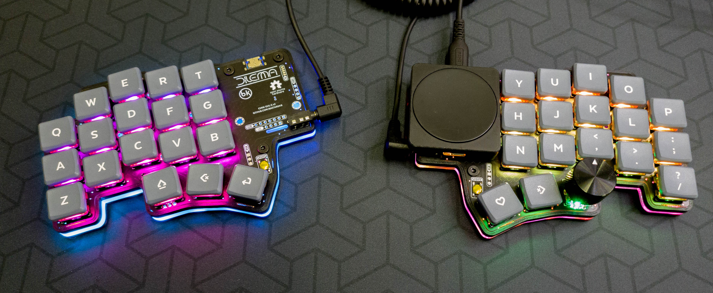

# Community Mods

## Tenting puck Hex cases

Credit: Frapiscide.

To be used with the Manfrotto tripod.

Files are in the `tenting_puck` folder.

### BOM

| Part name               | Amount | Notes               |
| ----------------------- | ------ | --------------------------- |
| M3x6 BHCS           | 3     | M3x8 BHCS work too |
| M3 Hex Nut | 3      |          |
| 3d printed case | 2      | Right / Left*        |

* You will need to print 2 cases - you can reverse it in your slicing software.

There are 2 versions:
- integrated holes to screw the manfrotto tripod directly
- hole for the splitkb tenting puck 

### Notes

- The case was designed around the DIY v0.1c PCB. Other versions may work but have not been verified
- The STL's are pre-oriented for their preferred printing position for FDM
- None of the parts need supports
- The case has .25mm of clearance all around the perimeter of the PCB
- The parts can be mirrored for whichever side you want the part for. The case and blank cover are originally modelled for the left side and the cirque holder for the right side. (Rev 1)

## Cirque holder for flat overlay

Credit: Frapiscide.

A simple holder for the flat overlay cirque trackpad.

Files are in the `40mm_flat_overlay` folder.

### BOM

| Part name               | Amount | Notes               |
| ----------------------- | ------ | --------------------------- |
| M3x4 Heat-set inserts           | 4     |  |
| M3x6 BHCS / SHCS | 4      |          |
| 40mm cirque trackpad, flat overlay | 1      | TM040040-2024-302         |
| Pieces of 1.75mm Filament | 3      | 50-75mm is more than enough*        |

* If you do not have filament available, alignment key STL's are included

### Notes

- The STL's are pre-oriented for their preferred printing position for FDM
- None of the parts need supports
- The Cirque trackpad holder should work with MX keycaps (18mm x 18mm) but has not been verified. (Rev 1)
- The cirque holder was tested with Cirque Part Number TM040040-2024-302. Others may fit but have not been verified.
- The upper and lower cirque holders require bits of filament and adhesive to hold the two parts together. It was designed this way to prevent the use of supports and maintain dimensional accuracy
- The filament / alignment keys are intentionally a tight fit to maintain alignment.

## Blank cover

Credit: Frapiscide.

### BOM

| Part name               | Amount | Notes               |
| ----------------------- | ------ | --------------------------- |
| M3x4 Heat-set inserts           | 4     |  |
| M3x6 BHCS / SHCS | 4      |          |
| 40mm cirque trackpad, flat overlay | 1      | TM040040-2024-302         |
| Pieces of 1.75mm Filament | 3      | 50-75mm is more than enough*        |

### Notes
- The STL's are pre-oriented for their preferred printing position for FDM.
- None of the parts need supports.